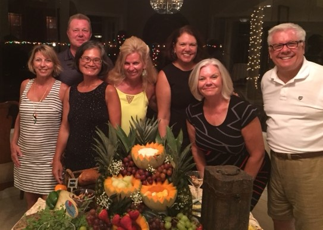

# Retirement milestone: 3 months and counting
*2015-09-16*

Three months into retirement and I’m either excelling or failing, depending on your perspective. <!--more-->Since June 12, I've:

- Seen nine countries in 24 days on a cruise to the Baltic and highlands, wrapping up with three days in New York City to see our daughter Regan and check out the new World Trade Center and Observatory
- Taken six tennis lessons and played nearly daily, plus gotten a terrific new racquet: The Wilson Envy 110
- Taken up bridge again with Randy after a seven year hiatus, earning 12.57 master points at the Bonita Bridge Club, adding to the 110 or so we had before.
- Went on our first retirement road trip, to Gasparilla Island, and saw our first Goliath groupers in person.
- Read seven books: Leaving Time, A Spool of Blue Thread, The Nightingale, The Swimmer, The Revolutions, Unbroken, Old Man's War, Grey (really?)
- Hosted a tennis dress collection party to benefit PACE as my first post-retirement project, mustering 228 garments and $1085 thanks to generous friends and an awesome planning team.
    

*Love that tennis dress party planners to support PACE center for girls*

- Instigated brainstorming to support Courtney Vernon, coach of the FGCU women's tennis team.
- Established my local Perkins as my consulting office
- Taken naps nearly weekly
- Watched most of the U.S. Open tennis tourney, which is more tennis than I've watched in my life
- Pulled together a reunion in Chicago that will reconnect friends from college, high school and grammar school. (Look for my next post!)
- Gotten Mom into English as a second language class through the Lee County Public Schools—twice a week for three months for $30! This was her idea and I’m so proud of her. She actually tested into the highest of three levels.
- Begun reviewing my 1999 draft of the family-based novel I plan to tackle. How do you like this lead? "Even the moon had forsaken them."
- Created a website: [meimeikirk.com](http://meimeikirk.com)

The best part of retirement is not grappling with hundreds of emails daily, mostly complaints/concerns/problems of various types. It's still astonishing to go hours without a single new email. Where is everyone?

The worst part is having to deal with technology myself--I still haven’t gotten the calendars and contacts to completely sync across the laptop, outlook, Microsoft mail and my Iphone.

So I often don't know what day it is, or what I've got going on, much to Randy's dismay. My calendar isn't syncing, I complain. _My_ calendar works just fine, he says--referring to his meticulous word document. (This is also the man who despises smart phones because he thinks they make people stupid. Maybe he's right.)

Time. What a luxury. (Though, amazingly, still a limited luxury). It's OK to sit and watch tennis for hours. It’s OK to take Mom on errands and become a Costco frequent flyer. It's OK to stay up later or wake up earlier. Or not.

No longer bound by the job and its pressing demands, one places different value on what's important.

Living.
