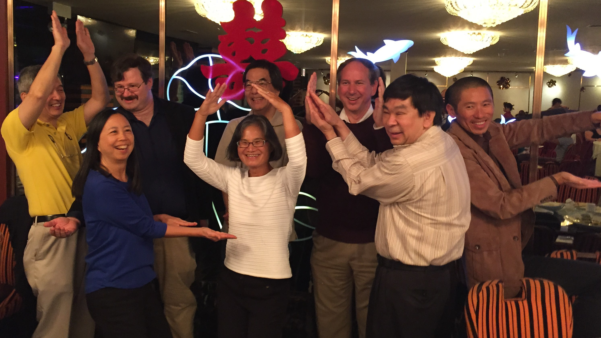
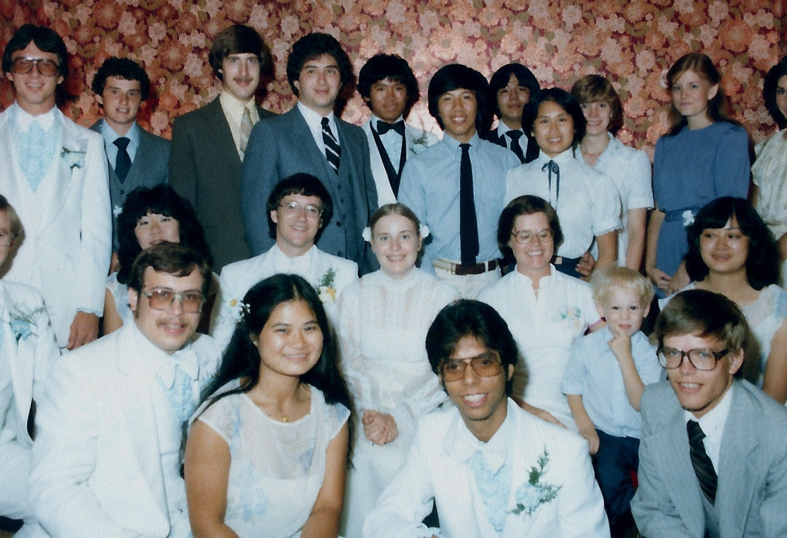
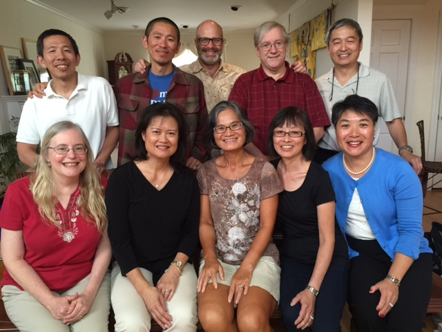

---
# Reunion magic: Yes, you can go home again
*2015-09-28*

**Chapter one of three**

It wasn't The Big Chill, but there were deaths and revelations.

It started five years ago, when I turned 50.

The half-century milestone shook my sense of immortality. I yearned to be grounded, and reached out to those who were part of my foundation: my close circle of childhood friends.

Everyone was game for a reunion but we couldn’t pull it off. (By the way, all the angst was in the anticipation. Once the 5-0 day came, it was no big deal.)

After I retired June 12, one of my first projects was to rally the gang to reunite in Chicago, where we grew up. Negotiating calendars, coordinating housing, devising a program, widening and filling in the circle (thanks, Facebook!), setting up tours of the old haunts, and arranging a banquet: no problem. Thirty years ago, I was the ringmaster; now we all ran our own circuses: only tiny head-butting problems.

The typical school reunions did not appeal to us because our cohorts were too large (1,000 at Lane Tech High School, where we graduated in 1977) and truly, there were only a few who mattered. Since graduating from the University of Illinois (Champaign/Urbana) in 1981, our interactions were rare and often only through Facebook and holiday cards.

*1977 graduates of Lane Tech High School attempt to spell out LANE.*

And thus, the weekend of Sept. 18 became the magnificent reunion as 11 of us from grammar school, high school and college came together, with six flying in from around the country. Another 12 came to a festive dinner in Chinatown (which has sprawled nicely). And to top it off, our favorite teacher, from high school, dropped in.

So many emotions surged and swirled as we shrieked, hugged, laughed, cried, reminisced, shared, interrogated, gawked and gushed. What happened with you; what are you doing; how many kids do you have; what are they doing; how about so and so; what’s important to you; _how are you, really_. So much to learn in a short time.

In a blink of an eye, we've become middle-aged adults with grown children—some of whom are retracing our paths at our alma mater. We are different people today, physically, mentally, spiritually—some surprisingly so. Two or three I would not have picked out in a crowd. Did we really have anything in common anymore? Did we still care?

Yes. And yes. Because our roots are indelibly intertwined. We nurtured each other into adulthood, through puberty, boyfriends and girlfriends, copious quantities of food, all-nighters, religious epiphanies and questions, changes in majors, volleyball, parental angst, music, disco dancing, more food (Papa Dell’s!), and weddings. We knew each other before we knew ourselves.

All these years later, Sue and Bill were still sweet and gentle; Bernice quiet with a bite; Linda, Eileen and Bill, all no-nonsense; Tak mature before his time; and David, always the questioner. Our dwarf nicknames turned out omniscient for some--Sleepy turned out to have sleep apnea; Sneezy had health issues; and Doc became a doctor--and ironic for others--Happy is grappling with tough issues. (If you must know, I was Dopey, because as the leader, I knew no one else would want to be.)

*August 1981: U of I alum celebrate Sue and Bill's wedding.*

*September 2015: Sue tries to recall who all her guests were and what they're doing now.*

Because of those bonds, we noticeably granted each other more respect, more patience, more acceptance than we typically would with strangers (and sometimes loved ones). Even if we didn’t quite see eye to eye, we had no desire to go toe to toe.

I was a nerd (radio club!) and we were the brainiacs, so it wasn’t a surprise that nearly all are successful, with happy, healthy families, respected careers, and many diplomas. At 55 or so, none felt the need to impress.

But we shared painful moments, too, of feeling uncertain and alienated as youngsters, of sexual and religious dilemmas, of taking bold risks to change the course of our lives, of fretting about our kids and our parents. I've struggled with depression since college, one confided. I came out in our last semester, another said. I got involved in a cult, said a third. Three of our group, pictured happily side-by-side during a wedding, were gone: one of AIDS, one of cancer; and one of a heart attack while training for a marathon.

Today, as 60 looms, we’re all in transition: some are thinking of retirement, cutting back to enjoy life more—or are already doing so; others just became empty nesters and are pondering the next phase. What does the future hold? Stay tuned, we said to each other.

 
*U of I graduates and spouses reunite in September for the first time since 1981 (not all are pictured).*

We talked about the next reunion, without resolution. (Burning Man! Champaign! San Francisco! A cruise!) We left each other joyfully, knowing that part of us lives on, in other hearts.

I am very private by nature, fiercely loyal, and maybe embarrassingly sentimental. So I treasured this weekend. I cherish these people.

I was moved to express my pride in their accomplishments, especially those who were later bloomers.

And I choked up as I thanked them for shaping me into who I am.

We all have people like these in our lives—even if you don’t think you do. No need to wait 30 years or travel long distances. Reach out today.

**Chapter Two: Returning to the old haunts of grammar and high schools**

**Chapter Three: Family intersections and crossroads**
